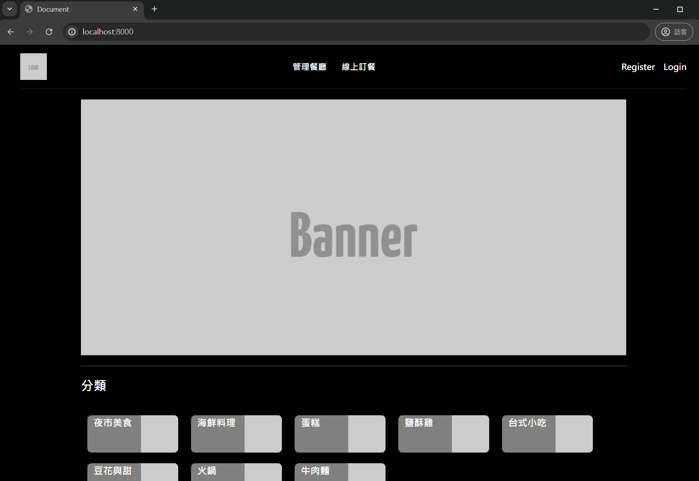
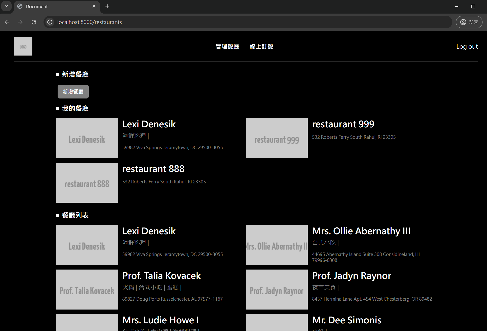

# Foodcata
## 簡介
這是一個使用 Laravel 11 構建的專案，
旨在熟悉新版本框架與展示我對 Laravel 的編寫的慣例。

專案包括使用 Queue Jobs、Observers 和 Policies 等技術，展示了如何利用 Laravel 的功能來構建一個具有可讀性、可維護的應用程序。

## 主頁面

### 預覽圖
使用 Blade 製作可複用的 Components 配合 TailWindCSS 
#### 主畫面預覽圖：


### 餐廳列表預覽圖：


## Stacks
- Laravel 11: 最新版本 (2024/03 釋出)。

- Queue Jobs: 用於處理排隊任務，提升應用程序的性能和響應速度。 (目前使用DB)

- Observers: 用於監聽 Controller，實現自動化處理邏輯。

- Policies: 用於封裝授權邏輯，控制用戶對資源的訪問權限。

- Redis: 用於Queue Jobs的後端服務。(尚未實裝)

## 主要功能

- 餐廳管理
    - 使用者可以添加、編輯和刪除餐廳。

- 排程工作
    - 當新餐廳 Create 時，系統會自動排隊一個作業來處理後續任務，如發送通知等。

- Observers
    - 當餐廳創建時，使用 Observer 自動dispatch Job 處理相關邏輯。

- Policies
    - 使用 Policies 控制用戶對餐廳的操作權限，僅允許餐廳擁有者進行編輯和刪除操作。

## 技術細節
### 使用 Queue Jobs

使用了 Laravel 的隊列功能來處理較耗時的作業，避免使用者等待 Respond 太久。
RestaurantCreatedLogging 負責在餐廳創建後執行後續處理工作，如日誌紀錄。

```php
// app/Jobs/RestaurantCreatedLogging.php

public function handle(): void
{
    // 模擬較慢的工作
    sleep(5);

    // 處理完後, 在專門的 log 中留下處理結果
    Log::channel('restaurant_jobs')->info('Processing Restaurant Created', [
        'restaurant_id' => $this->restaurant->id,
        'restaurant_name' => $this->restaurant->name,
        'restaurant_user_id' => $this->restaurant->user_id,
    ]);
}
```

### 使用 Observers
使用 Observers 監聽 Controller ，當餐廳創建時 Observer 會 Dispatch job，讓 Controller 能更專注在本身職責。

```php
// app/Observers/RestaurantObserver.php

class RestaurantObserver
{
    public function created(Restaurant $restaurant)
    {
        RestaurantCreatedLogging::dispatch($restaurant);
    }

}
```


### Foodcata 版本
+ 0.0.1
    + 增加Restautrant 模組

### 聯繫方式
Email: wells.liu645@gmail.com
